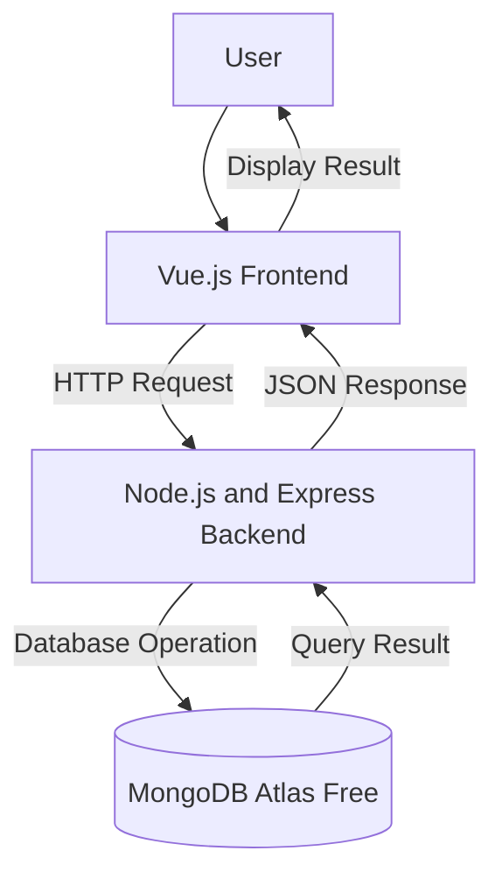

# System Architectural Design

## 1. System Overview
The Library Management System is a web-based application that digitizes
the process of borrowing and returning books in a school library. It
allows the librarian to manage the book catalog and lets students
search for and borrow available books, replacing the current manual
logbook process.

## 2. Selected Architectural Pattern
The proposed system will use a three-tier client-server architecture.
The system will be divided into:
1. Presentation layer
2. Application layer
3. Data layer

This architecture separates the user interface, business logic, and data
management responsibilities.

## 3. Architectural Components

### Presentation Layer
The presentation layer will use Vue.js. It will display the book
catalog, collect login and borrowing input from users, and send
requests to the backend.

### Application Layer
The application layer will use Node.js and Express. It will receive
requests, validate login credentials, check book availability, apply
borrowing rules, and communicate with the database.

### Data Layer
The data layer will use MongoDB Atlas Free. It will store, retrieve,
update, and delete book records and borrowing transactions.

## 4. Component Responsibilities

| Component | Technology | Responsibility |
|---|---|---|
| User interface | Vue.js | Displays the book catalog and collects user input |
| Application server | Node.js and Express | Processes borrowing requests and applies library rules |
| Database | MongoDB Atlas Free | Stores and manages book and transaction records |
| Repository | GitHub | Stores documentation and tracks changes |

## 5. System Architecture Diagram



## 6. Data Flow

### Example Process: Borrow a Book
1. The user searches for a book through the Vue.js interface.
2. Vue.js checks that the required input fields are filled in.
3. The frontend sends an HTTP request to the Express backend.
4. The backend validates the request and checks book availability.
5. The backend sends a database operation to MongoDB.
6. MongoDB updates the book record as borrowed.
7. MongoDB returns the result to the backend.
8. The backend sends a JSON response to the frontend.
9. The frontend displays a borrowing confirmation message.

## 7. Database Plan

### Proposed Database Name
```text
library_management_db
```

### Primary Collection
```text
books
```

### Proposed Fields

| Field | Type | Description |
|---|---|---|
| _id | ObjectId | Unique record identifier |
| title | String | Title of the book |
| author | String | Author of the book |
| status | String | Current status (available or borrowed) |
| borrowedBy | String | Student who currently has the book |
| createdAt | Date | Date the record was created |
| updatedAt | Date | Date the record was updated |

## 8. Design Justification
The three-tier architecture is appropriate for the Library Management
System because it separates the user interface, business logic, and
data storage into independent layers. This separation makes the system
easier to maintain, since each layer can be updated without affecting
the others. It also improves security, because the database is never
accessed directly by the frontend, and it makes testing easier, since
each layer can be tested on its own. This structure also allows future
development, such as adding fine calculation or notifications, to be
added in later modules without redesigning the entire system.

## 9. Architectural Limitations
The current activity focuses only on the proposed architecture. Frontend
code, backend code, database connection, user authentication, and deployment
have not yet been implemented. These components will be developed in Module 7.